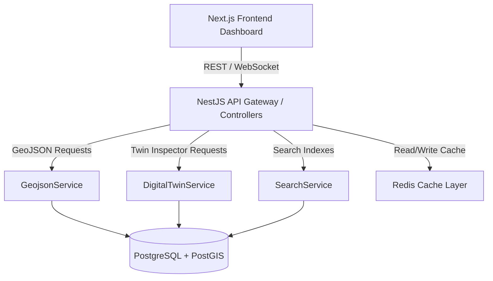
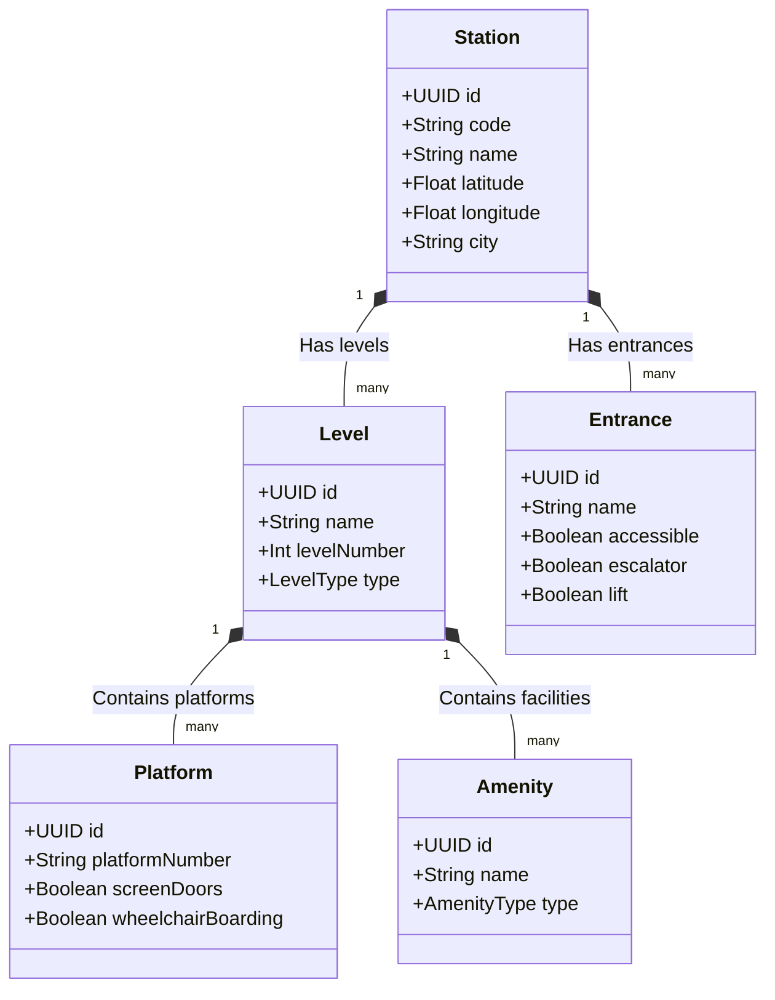

# MetroRadar Architecture Manual

This document details the architectural principles, design patterns, data schemas, and engineering strategies powering the MetroRadar Urban Mobility Platform.

---

## 🗺️ System Overview

MetroRadar is structured as a modular, containerized monorepo composed of a NestJS backend application, a Next.js frontend dashboard, and a PostGIS/Redis data layer.



---

## 🏢 1. Digital Twin Architecture
MetroRadar models transit assets as a multi-layered geospatial digital twin. Instead of representing stations as simple coordinate points, they are treated as composite, nested spatial structures representing physical, operational, and commercial properties.



### Digital Twin Payload Structure (`GET /stations/:id/digital-twin`)
The response maps assets cleanly into logical namespaces:
1.  **Physical Namespace**: Grouping `levels`, `platforms`, and `entrances` with their coordinates, status, and constraints.
2.  **Services Namespace**: Houses `amenities` (elevators, restrooms, ticketing) and `commercial` (spaces and outlets).
3.  **Operational Namespace**: Telemetry data (e.g. real-time crowding metrics, alerts, and operational states).

---

## 🗃️ 2. Canonical Transit Model (CTM)
The database schema standardizes raw GTFS, OpenStreetMap (OSM), and operator-specific dataset schemas into a unified **Canonical Transit Model (CTM)** in PostgreSQL using Prisma.

```
       [System] (Delhi Metro, Kochi Metro, Mumbai Metro)
          │
          ├── [Agency] (Operator details, websites)
          │
          ├── [Line] (Routes: Yellow Line, Blue Line, etc.)
          │      │
          │      └── [Trip] (Individual scheduled vehicle journeys)
          │             │
          │             └── [StopTime] (Scheduled stop arrivals)
          │                    │
          └── [Station] ◄──────┘
                 │
                 ├── [Level] (Concourse, Platform, Street)
                 │      │
                 │      └── [Platform] (Boarding berths)
                 │
                 ├── [Entrance] (Station entrance/exit doors)
                 │
                 └── [Amenity] (Elevators, Restrooms, Ticketing)
```

---

## 🌍 3. GeoJSON Philosophy
All spatial vector graphics returned to the client are serialized directly as database-aggregated **GeoJSON FeatureCollections** using PostGIS spatial functions (`ST_AsGeoJSON`, `ST_MakePoint`, `ST_MakeLine`) combined with PostgreSQL raw JSON aggregations (`json_build_object`, `json_agg`).

### Key Principles:
*   **Zero Client-Side Calculation**: The client does not assemble points into lines or project coordinates. It receives pure, render-ready GeoJSON features and drops them directly into the MapLibre GL rendering canvas.
*   **Versioned Envelopes**: All GeoJSON endpoints wrap the standard `FeatureCollection` inside a metadata envelope containing the API version, a generation timestamp, and the system ID context.
*   **Database-Level Reconstruction**: Geometries like route lines are reconstructed on-the-fly by querying sequential stop coordinates or shape vectors directly in the SQL engine, avoiding expensive Node.js parsing overhead.

---

## 🔌 4. Layer Registry Control
Rather than hardcoding map layers on the client-side, MetroRadar implements a **Layer Registry (`GET /map/layers`)**.

### Benefits:
*   **Dynamic Styling**: The backend controls which layers are active, their styles (circle radius, line width, vector colors), default visibility, and the backend endpoints supplying the data.
*   **Extensibility**: Adding a new GIS layer (e.g., live vehicle positions or train heatmaps) is done by registering it in the backend's `geojson.service.ts`. The client automatically detects the new layer, adds a toggle in the sidebar, and renders it on the map.

---

## ⚡ 5. Cache Strategy (Redis Namespaces)
Real-time mobility platforms handle thousands of requests per second. To prevent database exhaustion, MetroRadar employs a structured Redis caching strategy.

### Namespace Partitioning:
*   `geojson:*`: Caches compiled GeoJSON layers (e.g., `geojson:lines`, `geojson:stations`).
*   `digitaltwin:*`: Caches assembled station digital twin payloads (e.g., `digitaltwin:station:<uuid>`).
*   `search:*` / `nearby:*`: Caches autocomplete results and spatial radius query coordinates.

### Cache Lifecycle:
*   **TTL**: Cached records have a standard time-to-live (e.g., 3600 seconds).
*   **Active Invalidation**: Whenever a new GTFS Static import completes successfully or station details are edited, the backend calls `this.redisService.delByPattern('geojson:*')` to purge all cached GIS layers, forcing an on-demand rebuild.

---

## 🧩 6. Service Decomposition
The GIS module enforces strict separation of concerns to keep the codebase highly maintainable:
*   **Controllers**: Handle incoming HTTP requests, route param validation, and cache lookup/write-back.
*   **GeojsonService**: Focused exclusively on database-level GeoJSON geometry construction and layer registries.
*   **DigitalTwinService**: Assembles nested composite physical and telemetry properties of stations.
*   **SearchService**: Powers text indexing and PostGIS geospatial radius metrics.

---

## 📌 7. API Versioning & Contracts
*   **URL Versioning**: All production routes will eventually follow `/api/v1/...` to guarantee backward compatibility for third-party integrations.
*   **Strict Contracts**: Output schemas use TypeScript interfaces and class-validator DTOs, keeping schema contracts secure.
*   **Automatic Fallbacks**: Data mismatches (such as missing GTFS route colors) are captured and normalized at the service layer before reaching the client, preventing runtime crashes.
