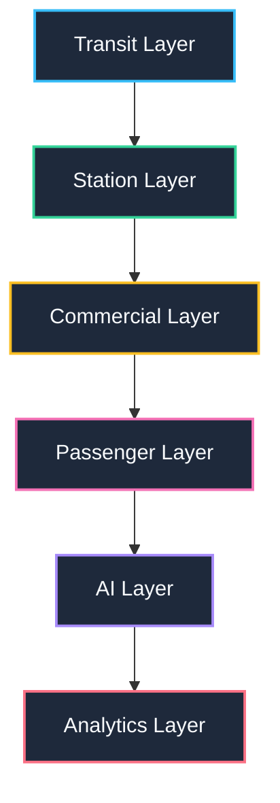

# MetroRadar Roadmap

This roadmap documents the 6-month product vision and the 10-Sprint modular LEGO build plan for the **MetroRadar** platform.

---

## 📅 6-Month Product Vision: Urban Mobility Intelligence Platform

Instead of a simple map application, MetroRadar is structured as six independent, integrated layers built step-by-step:



1.  **Transit Layer (Month 1-2)**: Core scheduling data, timetables, and train lines mapping.
2.  **Station Layer (Month 2-3)**: Detailed directories, platforms mapping, crowd flow capacities.
3.  **Commercial Layer (Month 3-4)**: Advertisements, in-station retail vendor details, localized offerings.
4.  **Passenger Layer (Month 4)**: Profiles, commute logs, routine schedules, preference indexing.
5.  **AI Layer (Month 5)**: Real-time delay propagation algorithms and custom commuter recommendations.
6.  **Analytics Layer (Month 6)**: Live administration metrics, commuter density analysis, platform performance insights.

---

## 🧱 The 10 LEGO Sprints

We build MetroRadar by crafting independent blocks that assemble together. Each sprint yields a fully functional, tested artifact.

```
Sprint 1 (Infrastructure) ──> Sprint 2 (Database) ──> Sprint 3 (Authentication) ──> Sprint 4 (Stations) ──> Sprint 5 (Lines)
                                                                                                                │
                                                                                                                ▼
Sprint 10 (AI) <── Sprint 9 (Commercial) <── Sprint 8 (Routing) <── Sprint 7 (GTFS) <── Sprint 6 (Maps) <────────
```

### Sprint 1: Infrastructure
*   **Goal**: Establish a scalable environment.
*   **Outputs**: Docker compose, monorepo settings, TS/lint settings, pre-commit hooks.

### Sprint 2: Database
*   **Goal**: Model core tables and geographical components.
*   **Outputs**: PostGIS schemas, spatial indices, seeds, and initial migrations.

### Sprint 3: Authentication
*   **Goal**: Standardize security protocols.
*   **Outputs**: Secure JWT tokens, register/login APIs, endpoint authorization guards.

### Sprint 4: Stations
*   **Goal**: Build station indexing and search tools.
*   **Outputs**: Spatial lookup API (e.g., finding nearest station), station facility listings.

### Sprint 5: Lines
*   **Goal**: Define transit path coordinates and static schedule tables.
*   **Outputs**: Track geometries, static schedules database schemas, route search APIs.

### Sprint 6: Maps
*   **Goal**: Create visual frontend interfaces.
*   **Outputs**: Interactive map page, dynamic line plotting, stations rendering layer.

### Sprint 7: GTFS Ingestion
*   **Goal**: Consume live transit data updates.
*   **Outputs**: Sync pipelines parsing GTFS/GTFS-RT, real-time database update workers.

### Sprint 8: Routing
*   **Goal**: Offer pathfinding routes across lines.
*   **Outputs**: A*/Dijkstra implementation API, multi-line transfer algorithms, travel time estimator.

### Sprint 9: Commercial
*   **Goal**: Build monetization and vendor directories.
*   **Outputs**: Ads server/bidding boilerplate, station vendor locator API, deals portal.

### Sprint 10: AI
*   **Goal**: Generate smart recommendations.
*   **Outputs**: Predictive delay engine, personal route assistant leveraging combined passenger data and static histories.
