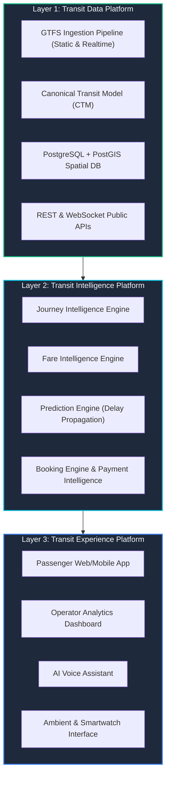

# TransitOS Roadmap
This roadmap documents the multi-phase product vision, the three vertical platform layers, and the version-based roadmap (v0.5 to v1.2) for the **TransitOS** platform.

---

## 📅 Platform Vision: The Three Vertical Layers
Instead of a simple map application, TransitOS is structured as three independent, integrated platform layers that stack on top of each other:


```mermaid
graph TD
    subgraph Layer3["Layer 3: Transit Experience Platform"]
        A["Passenger Web/Mobile App"]
        B["Operator Analytics Dashboard"]
        C["AI Voice Assistant"]
        D["Ambient & Smartwatch Interface"]
    end

    subgraph Layer2["Layer 2: Transit Intelligence Platform"]
        E["Journey Intelligence Engine"]
        F["Fare Intelligence Engine"]
        G["Prediction Engine (Delay Propagation)"]
        H["Booking Engine & Payment Intelligence"]
    end

    subgraph Layer1["Layer 1: Transit Data Platform"]
        I["GTFS Ingestion Pipeline (Static & Realtime)"]
        J["Canonical Transit Model (CTM)"]
        K["PostgreSQL + PostGIS Spatial DB"]
        L["REST & WebSocket Public APIs"]
    end

    Layer1 --> Layer2
    Layer2 --> Layer3

    style Layer1 fill:#1e293b,stroke:#10b981,stroke-width:2px,color:#f8fafc
    style Layer2 fill:#1e293b,stroke:#06b6d4,stroke-width:2px,color:#f8fafc
    style Layer3 fill:#1e293b,stroke:#3b82f6,stroke-width:2px,color:#f8fafc
```

---

## 🧱 Phased Sprints Roadmap (v0.5 to v1.2)
We build TransitOS by crafting independent, loosely-coupled blocks that connect through stable APIs.

```
v0.5 (Journey API) ──> v0.5.1 (Realtime) ──> v0.6 (Web UI) ──> v0.7 (Predictions) ──> v0.8 (Fare Engine)
                                                                                            │
                                                                                            ▼
v1.2 (Ambient) <── v1.1 (Voice & AI Gateway) <── v1.0 (Payments) <── v0.9 (Booking Platform) <──┘
```

### 🏁 Phase 1: Core Transit & Maps (Immediate MVP Sprints)

#### **v0.5 — Journey Intelligence**
*   **Goal**: Establish the base transit data platform and offline route mapping.
*   **Deliverables**:
    *   Monorepo configs (npm workspaces, Turbo / Lerna settings).
    *   PostGIS schema definitions and Mumbai Metro database seeding.
    *   GTFS Static importer pipeline with transaction-safe validation CLI.
    *   Core graph-based routing engine utilizing Dijkstra/A* for station paths.

#### **v0.5.1 — Realtime Ingestion & Cache**
*   **Goal**: Feed live vehicle positions and service warnings into the system.
*   **Deliverables**:
    *   GTFS-Realtime Protobuf parsers (Vehicle Positions & Trip Updates).
    *   Redis cache layer configuration for telemetry overlays (avoiding PostgreSQL write locks).
    *   Background pollers and synchronization workers.
    *   WebSocket broadcast channels for pushing real-time alerts directly to browsers.

#### **v0.6 — Passenger Experience (UI)**
*   **Goal**: Build a premium dark-mode web application and administrative analytics dashboard.
*   **Deliverables**:
    *   Next.js frontend template with responsive layout structures.
    *   Interactive map layout using Leaflet/MapLibre.
    *   Dynamic path plotting, color-coded lines, and station markers.
    *   Detailed station layout panel showcasing platform lists and entrance status.

---

### 🚀 Phase 2: Intelligence & Optimization (Middle Sprints)

#### **v0.7 — Prediction & Live Notifications**
*   **Goal**: Generate travel notifications and forecast live train arrival delays.
*   **Deliverables**:
    *   Historical delay regression model analyzing timetable deviations.
    *   Proactive push notification service for service interruptions.
    *   Passenger saved routes and profile notification subscriptions.

#### **v0.8 — Fare Intelligence Engine**
*   **Goal**: Add fare calculation engines to optimize passenger commute costs.
*   **Deliverables**:
    *   Fare matrix database models (Zone pricing, flat rates, distances).
    *   Fare capping analyzers and transfer discount trackers.
    *   Eligibility selectors for transit concessions (Senior, Student, Corporate).
    *   Pass recommendation engine (e.g., advising a day pass over single tickets).

---

### 💳 Phase 3: Ticketing, Payments & AI (Advanced Sprints)

#### **v0.9 — Booking Engine & Adapters**
*   **Goal**: Abstract ticket booking and support external ticketing brokers.
*   **Deliverables**:
    *   Unified ticket representation object (Standard JSON schema).
    *   Core Booking Engine operations (`bookJourney()`, `cancelJourney()`, `refundTicket()`).
    *   Provider Adapter Layer isolating integration logic for ONDC or official operator APIs.

#### **v1.0 — Payment Intelligence & Wallet**
*   **Goal**: Optimize payment routing and link passenger wallets without regulatory limits.
*   **Deliverables**:
    *   Virtual Payment Profile / Wallet abstraction managing passes and preferences.
    *   Payment Intelligence Engine selecting the cheapest payment method (NCMC card, linked UPI, or stored value).
    *   Payment Adapter Layer isolating third-party gateways.

#### **v1.1 — AI & Language Gateway**
*   **Goal**: Integrate conversational routing via a vendor-independent gateway.
*   **Deliverables**:
    *   Intelligence Gateway routing logic determining if LLMs are needed.
    *   AI Capability Registry mapping functions to LLM providers (Sarvam AI for voice/Marathi speech, OpenAI for reasoning, Gemini for signage vision).
    *   Strict separation of data logic (computations happen in core engines, LLM acts as the voice interface).

#### **v1.2 — Ambient & Proactive Computing**
*   **Goal**: Drive smart watch alerts and calendar actions.
*   **Deliverables**:
    *   Smartwatch remote interface for ticketing and ETAs.
    *   Calendar connector to preemptively book rides or issue alerts (e.g., "Airport meeting tomorrow: Day Pass recommended").
    *   AR indoor routing prototypes using Gemini vision features.
