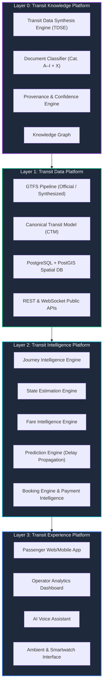

# TransitOS Roadmap
This roadmap documents the multi-phase product vision, the four vertical platform layers, and the version-based roadmap (v0.5 to v1.2) for the **TransitOS** platform.

> **See [GTFS_SYNTHESIS.md](./GTFS_SYNTHESIS.md)** for the complete specification of the Transit Data Synthesis Engine (TDSE), document classification system, and the all-metro synthesis strategy.

---

## 📅 Platform Vision: The Four Vertical Layers
TransitOS is India's GTFS Infrastructure Platform, structured as four independent, integrated platform layers:


```mermaid
graph TD
    subgraph Layer3["Layer 3: Transit Experience Platform"]
        A["Passenger Web/Mobile App"]
        B["Operator Analytics Dashboard"]
        C["AI Voice Assistant"]
        D["Ambient & Smartwatch Interface"]
    end

    subgraph Layer2["Layer 2: Transit Intelligence Platform"]
        E["Journey Intelligence Engine"]
        SE["State Estimation Engine"]
        F["Fare Intelligence Engine"]
        G["Prediction Engine (Delay Propagation)"]
        H["Booking Engine & Payment Intelligence"]
    end

    subgraph Layer1["Layer 1: Transit Data Platform"]
        I["GTFS Pipeline (Official / Synthesized)"]
        J["Canonical Transit Model (CTM)"]
        K["PostgreSQL + PostGIS Spatial DB"]
        L["REST & WebSocket Public APIs"]
    end

    subgraph Layer0["Layer 0: Transit Knowledge Platform"]
        TDSE["Transit Data Synthesis Engine (TDSE)"]
        DC["Document Classifier (Cat. A–I + X)"]
        PV["Provenance & Confidence Engine"]
        KG["Knowledge Graph"]
    end

    Layer0 --> Layer1
    Layer1 --> Layer2
    Layer2 --> Layer3

    style Layer0 fill:#1e293b,stroke:#a855f7,stroke-width:2px,color:#f8fafc
    style Layer1 fill:#1e293b,stroke:#10b981,stroke-width:2px,color:#f8fafc
    style Layer2 fill:#1e293b,stroke:#06b6d4,stroke-width:2px,color:#f8fafc
    style Layer3 fill:#1e293b,stroke:#3b82f6,stroke-width:2px,color:#f8fafc
```

---

## 🧱 Phased Sprints Roadmap (v0.5 to v1.2)
We build TransitOS by crafting independent, loosely-coupled blocks that connect through stable APIs.

```
v0.5 (Journey API) ──> v0.5.5 (National GTFS Certification) ──> v0.6 (Stitch Web UI) ──> v0.7 (Operational State Platform)
                                                                                                        │
                                                                                                        ▼
v1.2 (Ambient) <── v1.1 (Voice & AI Gateway) <── v1.0 (Payments) <── v0.9 (Booking Platform) <── v0.8 (Fare Engine)
```

### 🏁 Phase 1: Core Transit & Maps (Immediate MVP Sprints)

#### **v0.5 — Journey Intelligence**
*   **Goal**: Establish the base transit data platform and offline route mapping.
*   **Deliverables**:
    *   Monorepo configs (npm workspaces, Turbo / Lerna settings).
    *   PostGIS schema definitions and Mumbai Metro database seeding.
    *   GTFS Static importer pipeline with transaction-safe validation CLI.
    *   Core graph-based routing engine utilizing Dijkstra/A* for station paths.

#### **v0.5.5 — Sprint 5.5: National Transit Data Certification (COMPLETED ✅)**
*   **Goal**: Governance, quality scoring, and certification across all available Indian GTFS datasets to freeze CTM v1.0.
*   **Deliverables**:
    *   **5-Stage Governance Pipeline**: `DISCOVERED` ➔ `ACQUIRED` ➔ `VALIDATED` ➔ `CERTIFIED` ➔ `IMPORTED`.
    *   **Trust Tiers & Provenance**: `OFFICIAL` (`Trust Tier A`), `COMMUNITY` (`Trust Tier B`), `SYNTHESIZED` (`Trust Tier X`).
    *   **4-Tier Dataset Versioning**: `feedVersion`, `schemaVersion` (`CTM v1.0`), `importVersion` (`Sprint 5.5`), `datasetVersion`.
    *   **Pure Static Quality Scorer**: 5-dimension 100-pt quality score + coverage metrics.
    *   **Badge Tiers**: 🥇 Gold (90+), 🥈 Silver (80–89), 🥉 Bronze (70–79).
    *   **National Transit Status Dashboard**: Generated `INDIA_TRANSIT_STATUS.md` and individual system audit reports.
    *   **CTM v1.0 Schema Freeze**: Relational PostgreSQL database schema officially frozen.

#### **v0.6 — Passenger Experience (UI)**
*   **Goal**: Build a premium dark-mode web application and administrative analytics dashboard displaying certified Indian metro networks.
*   **Deliverables**:
    *   Next.js frontend template with responsive layout structures.
    *   Interactive map layout using Leaflet/MapLibre.
    *   Dynamic path plotting, color-coded lines, and station markers for certified cities.
    *   Detailed station layout panel showcasing platform lists and entrance status.

---

### 🚀 Phase 2: Intelligence & Optimization (Middle Sprints)

#### **v0.7 — Prediction & Live Notifications**
*   **Goal**: Generate travel notifications and forecast live train arrival delays.
*   **Deliverables**:
    *   Historical delay regression model analyzing timetable deviations.
    *   Proactive push notification service for service interruptions.
    *   Passenger saved routes and profile notification subscriptions.

#### **v0.8 — Fare Intelligence Engine**
*   **Goal**: Add fare calculation engines to optimize passenger commute costs.
*   **Deliverables**:
    *   Fare matrix database models (Zone pricing, flat rates, distances).
    *   Fare capping analyzers and transfer discount trackers.
    *   Eligibility selectors for transit concessions (Senior, Student, Corporate).
    *   Pass recommendation engine (e.g., advising a day pass over single tickets).

---

### 💳 Phase 3: Ticketing, Payments & AI (Advanced Sprints)

#### **v0.9 — Booking Engine & Adapters**
*   **Goal**: Abstract ticket booking and support external ticketing brokers.
*   **Deliverables**:
    *   Unified ticket representation object (Standard JSON schema).
    *   Core Booking Engine operations (`bookJourney()`, `cancelJourney()`, `refundTicket()`).
    *   Provider Adapter Layer isolating integration logic for ONDC or official operator APIs.

#### **v1.0 — Payment Intelligence & Wallet**
*   **Goal**: Optimize payment routing and link passenger wallets without regulatory limits.
*   **Deliverables**:
    *   Virtual Payment Profile / Wallet abstraction managing passes and preferences.
    *   Payment Intelligence Engine selecting the cheapest payment method (NCMC card, linked UPI, or stored value).
    *   Payment Adapter Layer isolating third-party gateways.

#### **v1.1 — AI & Language Gateway**
*   **Goal**: Integrate conversational routing via a vendor-independent gateway.
*   **Deliverables**:
    *   Intelligence Gateway routing logic determining if LLMs are needed.
    *   AI Capability Registry mapping functions to LLM providers (Sarvam AI for voice/Marathi speech, OpenAI for reasoning, Gemini for signage vision).
    *   Strict separation of data logic (computations happen in core engines, LLM acts as the voice interface).

#### **v1.2 — Ambient & Proactive Computing**
*   **Goal**: Drive smart watch alerts and calendar actions.
*   **Deliverables**:
    *   Smartwatch remote interface for ticketing and ETAs.
    *   Calendar connector to preemptively book rides or issue alerts (e.g., "Airport meeting tomorrow: Day Pass recommended").
    *   AR indoor routing prototypes using Gemini vision features.

---

### 🔬 Phase 4: GTFS Synthesis & All-Metro Expansion (Future Sprints)

> These sprints are **long-term architecture**, not upcoming execution work. They represent the next frontier after v1.2 and will be scoped into discrete sprints as earlier phases complete.

#### **v1.3 — Transit Data Synthesis Engine (TDSE) v1**
*   **Goal**: Build the first production version of the document ingestion and GTFS synthesis pipeline.
*   **Deliverables**:
    *   Document Repository with Category A–I classification UI
    *   Extraction pipelines for PDF timetables, DPR tables, and GIS shapefiles
    *   Physics modeler (distance + rolling stock → travel times)
    *   GTFS Schedule generator validated against `gtfs-validator`
    *   Provenance Engine: `ProvenanceRecord` attached to every synthesized field
    *   Confidence Scorer with passenger-facing label mapping (`Live` / `Approx.` / `Estimated` / `Scheduled`)
    *   First synthesized metro: **Mumbai Metro Line 1** (MMRDA)

#### **v1.4 — All-Metro Synthesis Rollout**
*   **Goal**: Onboard all operational Indian metro systems into TransitOS.
*   **Deliverables**:
    *   Phase 3 metros synthesized: Pune, Nagpur, Chennai, Lucknow, Ahmedabad, Jaipur, Kolkata, Kanpur
    *   Pre-synthesis for opening metros: Navi Mumbai, Agra, Indore, Surat, Patna, Bhopal
    *   Open data publication of all synthesized GTFS feeds
    *   Knowledge Graph covering full Indian metro network

#### **v1.5 — Full State Estimation & Estimated GTFS-Realtime**
*   **Goal**: Generate estimated GTFS-Realtime for metros with no official feed.
*   **Deliverables**:
    *   Full State Estimation Engine (SEE) with historical calibration
    *   Estimated GTFS-Realtime feeds for all synthesis-based metros
    *   Category I observation fusion (crowdsource + GPS traces)
    *   TransitOS becomes first community platform providing both GTFS Schedule AND estimated GTFS-RT for metros without official data
