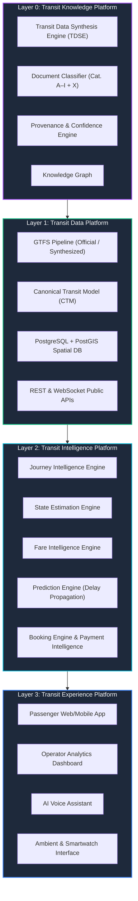

# TransitOS Roadmap
This roadmap documents the multi-phase product vision, the four vertical platform layers, and the version-based roadmap (v0.5 to v1.2) for the **TransitOS** platform.

> **See [GTFS_SYNTHESIS.md](./GTFS_SYNTHESIS.md)** for the complete specification of the Transit Data Synthesis Engine (TDSE), document classification system, and the all-metro synthesis strategy.

---

## 📅 Platform Vision: The Four Vertical Layers
TransitOS is India's GTFS Infrastructure Platform, structured as four independent, integrated platform layers:


```mermaid
graph TD
    subgraph Layer3["Layer 3: Transit Experience Platform"]
        A["Passenger Web/Mobile App"]
        B["Operator Analytics Dashboard"]
        C["AI Voice Assistant"]
        D["Ambient & Smartwatch Interface"]
    end

    subgraph Layer2["Layer 2: Transit Intelligence Platform"]
        E["Journey Intelligence Engine"]
        SE["State Estimation Engine"]
        F["Fare Intelligence Engine"]
        G["Prediction Engine (Delay Propagation)"]
        H["Booking Engine & Payment Intelligence"]
    end

    subgraph Layer1["Layer 1: Transit Data Platform"]
        I["GTFS Pipeline (Official / Synthesized)"]
        J["Canonical Transit Model (CTM)"]
        K["PostgreSQL + PostGIS Spatial DB"]
        L["REST & WebSocket Public APIs"]
    end

    subgraph Layer0["Layer 0: Transit Knowledge Platform"]
        TDSE["Transit Data Synthesis Engine (TDSE)"]
        DC["Document Classifier (Cat. A–I + X)"]
        PV["Provenance & Confidence Engine"]
        KG["Knowledge Graph"]
    end

    Layer0 --> Layer1
    Layer1 --> Layer2
    Layer2 --> Layer3

    style Layer0 fill:#1e293b,stroke:#a855f7,stroke-width:2px,color:#f8fafc
    style Layer1 fill:#1e293b,stroke:#10b981,stroke-width:2px,color:#f8fafc
    style Layer2 fill:#1e293b,stroke:#06b6d4,stroke-width:2px,color:#f8fafc
    style Layer3 fill:#1e293b,stroke:#3b82f6,stroke-width:2px,color:#f8fafc
```

---

## 🧱 Phased Sprints Roadmap

We build TransitOS by crafting independent, loosely-coupled blocks that connect through stable APIs.

```
v0.5 (Journey API) ──> v0.5.5 (National Certification) ──> v0.6 (Passenger UI) ──> v0.6.5 (National Expansion & Calibration)
                                                                                             │
                                                                                             ▼
v1.1+ (Wear OS / Ambient) <── v1.0 (Booking & ONDC) <── v0.9 (Voice & AI Gateway) <── v0.8 (Analytics) <── v0.7 (Prediction Engine)
```

---

### 🏁 Phase 1: Core Transit & National Expansion

#### **v0.5 — Journey Intelligence (COMPLETED ✅)**
*   **Goal**: Establish the base transit data platform and offline route mapping.
*   **Deliverables**:
    *   Monorepo configs (npm workspaces, Turbo settings).
    *   PostGIS schema definitions and CTM database seeding.
    *   GTFS Static importer pipeline with transaction-safe validation CLI.
    *   Core graph-based routing engine utilizing Dijkstra for station paths.

#### **v0.5.5 — National Transit Data Certification (COMPLETED ✅)**
*   **Goal**: Governance, quality scoring, and certification across all available Indian GTFS datasets to freeze CTM v1.0.
*   **Deliverables**:
    *   **5-Stage Governance Pipeline**: `DISCOVERED` ➔ `ACQUIRED` ➔ `VALIDATED` ➔ `CERTIFIED` ➔ `IMPORTED`.
    *   **Trust Tiers & Provenance**: `OFFICIAL` (`Trust Tier A`), `COMMUNITY` (`Trust Tier B`), `SYNTHESIZED` (`Trust Tier X`).
    *   **4-Tier Dataset Versioning**: `feedVersion`, `schemaVersion` (`CTM v1.0`), `importVersion` (`Sprint 5.5`), `datasetVersion`.
    *   **Pure Static Quality Scorer**: 5-dimension 100-pt quality score + coverage metrics.
    *   **Badge Tiers**: 🥇 Gold (90+), 🥈 Silver (80–89), 🥉 Bronze (70–79).
    *   **National Transit Status Dashboard**: Generated `INDIA_TRANSIT_STATUS.md` and individual system audit reports.
    *   **CTM v1.0 Schema Freeze**: Relational PostgreSQL database schema officially frozen.

#### **v0.6 — Passenger Experience & World-Class UI (COMPLETED ✅)**
*   **Goal**: Build a premium dark-mode web application displaying certified Indian metro networks.
*   **Deliverables**:
    *   Next.js frontend with MapLibre interactive map and real-time vehicle telemetry.
    *   Live Network Explorer with 3D Digital Twin station inspector (platforms, exits, levels, wheelchair status).
    *   Journey Planner with Dijkstra CTM pathfinding, clean line badges, towards headsigns, and step-by-step transfer cards.

#### **v0.6.5 — National Transit Data Expansion & Calibration Baseline (ACTIVE / NEXT)**
*   **Goal**: Build static/synthesized CTM baselines for uncovered metros and establish the empirical calibration foundation before prediction modeling.
*   **Deliverables**:
    *   **Mumbai CTM Baseline**: Synthesize/model Mumbai Metro (Line 1 Blue, Line 2A Yellow, Line 7 Red, Line 3 Aqua) + suburban railway interchanges into the unified CTM.
    *   **Tier-2 Metros CTM Baseline**: Ingest and model Pune, Nagpur, and remaining uncovered networks.
    *   **Calibration & Observation Platform**: Observation schema, ingestion pipeline for Raspberry Pi / phone GPS / official RT traces, and calibration data warehouse.
    *   **First-Class Provenance & Confidence**: Full Category A–I + X document classification and metadata (`sourceType: "OFFICIAL" | "COMMUNITY" | "SYNTHESIZED" | "OBSERVED"`, `confidence: 0.0–1.0`).
    *   **Multi-City Frontend Activation**: Dynamic city switcher between Delhi, Mumbai, Kochi, Bengaluru, Chennai, Hyderabad, Ahmedabad.

---

### 🚀 Phase 2: Operational Intelligence & Predictions

#### **v0.7 — Prediction & Operational Intelligence**
*   **Goal**: Build the Prediction Engine operating on the Unified CTM (Schedule + Historical Warehouse + Calibration data).
*   **Deliverables**:
    *   ETA forecasting and live delay propagation models.
    *   Empirically learned dwell times, headways, and transfer walking penalty distributions.
    *   Scheduled and estimated fleet-state digital twins.
    *   Proactive push notifications for service interruptions and passenger saved routes.

#### **v0.8 — Analytics & Operator Intelligence**
*   **Goal**: Platform analytics, line efficiency, and congestion modeling.
*   **Deliverables**:
    *   Line efficiency, bottleneck analysis, and transfer friction heatmaps.
    *   Station crowding index and capacity utilization forecasting.
    *   Operator intelligence dashboard.

---

### 🎙️ Phase 3: AI Gateway, Commerce & Multi-Interface

#### **v0.9 — Intelligence Gateway & Voice Laboratory**
*   **Goal**: Vendor-independent AI Gateway and conversational voice prototype.
*   **The Golden Rule**: *TransitOS computes. External AI communicates.* Core APIs execute all transit logic; external AI acts strictly as the voice/language interface.
*   **Deliverables**:
    *   Intelligence Gateway routing logic (Sarvam AI for Indian language STT/TTS, OpenAI for reasoning, Gemini for vision).
    *   **Telegram Voice Bot**: Interactive voice laboratory to test voice journey planning and conversational routing without mobile app friction.

#### **v1.0 — Commerce & Booking Platform (ONDC Integration)**
*   **Goal**: Unified ticket booking and fare optimization via open commerce protocols.
*   **Boundaries**: ONDC is strictly a transaction and discovery network, *never* the transit data warehouse. TransitOS abstracts payment methods (UPI, Card, NCMC, partner wallets) without holding user money.
*   **Deliverables**:
    *   Fare Intelligence Engine (multi-tier matrices, fare capping, transfer discounts, pass recommendations).
    *   Booking Engine & Provider Adapter Layer (ONDC Buyer Application Adapter, operator ticketing APIs).
    *   Standardized QR ticket representation and verification workflow.

#### **v1.1+ — Ambient Computing & Advanced Interfaces**
*   **Goal**: Multi-client ecosystem and proactive ambient computing.
*   **Deliverables**:
    *   **WhatsApp Business Interface**: Conversational ticketing and journey planning via WhatsApp.
    *   **Wear OS Smartwatch Client**: Next train ETAs, platform guidance, transfer steps, and QR ticket shortcuts.
    *   **Proactive Calendar Integrations**: Flight and meeting transit recommendations with voice confirmation boundaries.
